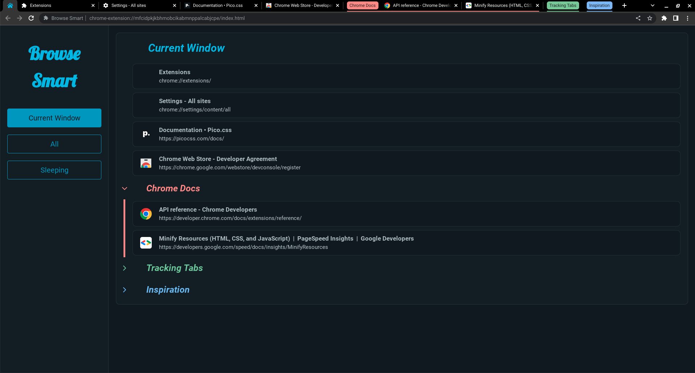

# Browse Smart


## Description

A Chrome Extension that creates a pinned tab in each window and syncs with a background service worker to display open tabs and allow the user to delete or sleep tabs for organization and speed

## Chrome Web Store

[Deployed Extension](https://chrome.google.com/webstore/detail/browse-smart/cfaokojidpjmmpaoheemadkjmmoecdlc)



## Table of Contents

- [Technologies](#technologies)

- [Installation](#installation)

- [Usage](#usage)

- [License](#license)

- [Questions](#questions)

## Technologies

- Svelte
- Pico.CSS
- Vite
- Chrome Manifest V3
- Javascript
- HTML
- CSS

## Installation

To install necessary dependencies, run the following command:

```
npm i
```

## Usage

N/A

## License

This project is licensed under the MIT license.

## Questions

If you have any questions about the repo, open an issue or contact me directly at jason.lieb@outlook.com. You can find more of my work at [github](https://github.com/jason-lieb/).
